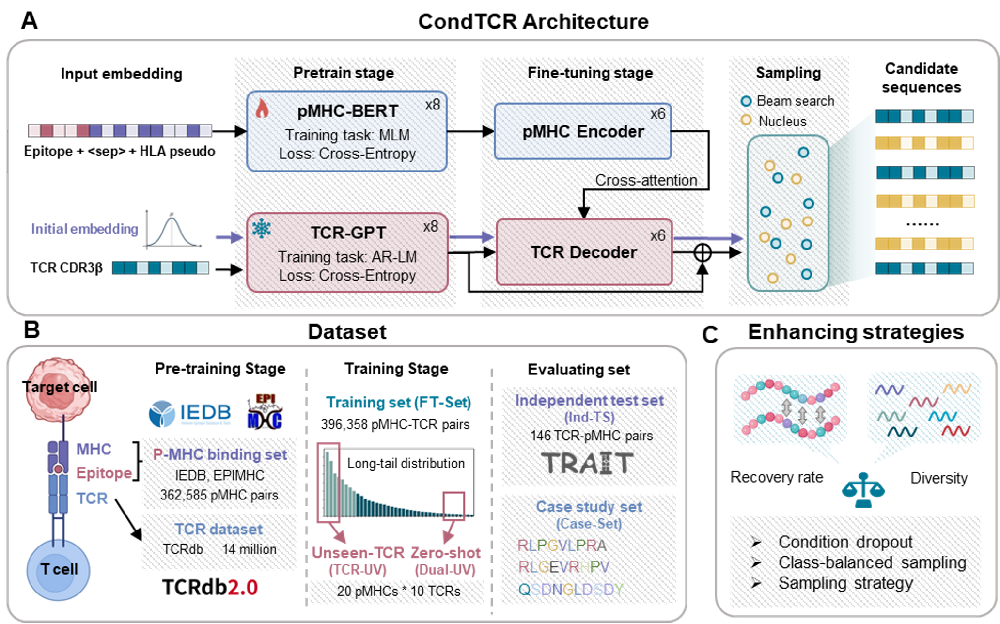

# A conditional generative framework for the discovery of TCR sequences against peptide-MHC complexes


## Features
● Epitope–MHC-guided TCR generation  
● Long-tail data augmentation  
● Hybrid sampling strategy  
● Bias analysis of generated TCR  
● Tumor neoantigen TCR generation  

## Overview

CondTCR, a conditional deep generative framework for pMHC-specific TCR discovery that explicitly facilitates comprehensive exploration of the pMHC-conditioned TCR space. CondTCR expands candidate coverage while preserving sequence recovery and biological plausibility. Compared with state-of-the- art methods, CondTCR increases the diversity of generated TCR sequences by 20% while minimally affecting sequence recovery accuracy across pMHCs. Finally, applying CondTCR to neoantigen-targeted TCR design yields promising candidates for three tumor neoantigens and demonstrates improved generalization to previously unseen antigens. 



## 🚀Installation

```bash
git clone https://github.com/wangwrx/CondTCR.git
cd CondTCR
```

## 📦Requirements

```bash
conda env create -f environment.yml
conda activate CondTCR
```

If installation using the environment file fails, try:

```bash
conda create -n CondTCR python=3.9
pip3 install torch torchvision --index-url https://download.pytorch.org/whl/cu126
pip install tqdm matplotlib numpy pandas scikit-learn scipy 
```
## 📥Download models and dataset

Then download the model and dataset file from: [https://zenodo.org/records/18932139](https://zenodo.org/records/18932139)

Place the model files into the `models/` folder and the dataset files into the `Data/` folder.

## ✨TCR CDR3β generation

Update the data and model file paths in the file, then run:

```bash
cd submit
bash test_ensemble.sh
```

## ⚙️Training CondTCR

Update the data and model file paths in the file, then run:

```bash
bash train.sh
```

## 🎯Model Output

The output of `train.sh` includes results for each training epoch, the best model, model parameters, and loss logs. The output of `test_ensemble.sh` includes a record of generation parameters and the generated sequence results. All files are saved in `Model_results/timestamp`.

## 📊Dataset

We provide all datasets used by CondTCR during pretraining, fine-tuning, and testing. The data structure is as follows:

```
├── Data                         # Dataset directory
│   ├── pairs                    # TCR–pMHC paired datasets
│   │   ├── train.csv            # Training dataset
│   │   ├── test_few.csv         # Few-shot test set
│   │   ├── test_zeroshot.csv    # Zero-shot test set
│   │   ├── test_TCRUV.csv       # TCRUV benchmark test set
│   │   ├── independent_clean.csv
│   │   └── ind_sparse_clean.csv
│   ├── pMHC                     # pMHC reference data
│   │   └── pMHC_36W_valid.csv
│   └── TCR                      # TCR sequence data
│       └── beta.csv
```


## 📚Citation

If you use CondTCR in your research, please cite our work and the foundational papers:

```bibtex
@article{condTCR2026,
  title={A conditional generative framework for the discovery of TCR sequences against peptide-MHC complexes},
  author={Ruixuan Wang, Junwei Chen, Hong Tan, Shenggeng Lin, Keyao Wang, Han Wang, Furui Liu, Binjian Ma, Yi Xiong},
  journal={},
  year={2026},
  doi={},
  url={}
}

@article{GRATCR2025,
  title={GRATCR: Epitope-specific T cell receptor sequence generation with data-efficient pre-trained models},
  author={Zhenghong Zhou , Junwei Chen , Shenggeng Lin , Liang Hong, Dong-Qing Wei , Yi Xiong},
  journal={IEEE Journal of Biomedical and Health Informatics},
  year={2025},
  doi={10.1109/JBHI.2024.3514089}
}

```

## 📄License

This project is licensed under the MIT License.

See the [LICENSE](LICENSE) file for details.
